```mermaid
graph TD
    A[Run ./install.sh] --> B[Detect Operating System]
    B --> C{OS Type}
    C -->|Debian-based| D[install_debian_packages]
    C -->|Red Hat-based| E[install_redhat_packages]
    C -->|macOS| F[install_macos_packages]
    C -->|Unsupported| G[Exit with Error]

    A --> H[Install Dotfiles]
    H --> I[Symlink Shared Dotfiles]
    I --> J{File Exists?}
    J -->|Yes & Symlink| K[Create Symlink]
    J -->|Yes & Not Symlink| L[Backup Existing File]
    J -->|No| M[Warn File Not Found]

    H --> N[Create Local Dotfiles]
    N --> O{Local File Exists?}
    O -->|Yes| P[Inform Existing File]
    O -->|No| Q[Create Empty File]

    H --> R[Setup Git Configuration]
    R --> S[Copy template.gitconfig to ~/.gitconfig]
    R --> T[Include .gitconfig.local]
    R --> U[Update .gitconfig.local]

    H --> V[Handle starship.toml]
    V -->|Exists| W[Create Symlink for starship.toml]
    V -->|Does Not Exist| X[Warn starship.toml Not Found]

    A --> Y[Install Starship Prompt]
    Y --> Z{Starship Installed?}
    Z -->|Yes| AA[Log Already Installed]
    Z -->|No| AB[Install Starship]

    A --> AC[Change Default Shell to bash]
    AC --> AD{Current Shell is bash?}
    AD -->|Yes| AE[Do Nothing]
    AD -->|No| AF[Change Shell to bash]

    A --> AG[Completion]
    AG --> AH[Log Success Message]
    AG --> AI[Inform About Backup Directory]
    AG --> AJ[Recommend Restarting Terminal]

    %% Styling
    classDef green fill:#cfc,stroke:#333,stroke-width:2px;
    classDef red fill:#fcc,stroke:#333,stroke-width:2px;
    classDef yellow fill:#ffc,stroke:#333,stroke-width:2px;
    class G red;
    class K,L,M,P,Q,W,X green;
    class Y,Z,AA,AB,AC,AD,AE,AF,AG,AH,AI,AJ yellow;
```

### Explanation of the DAG

1. **Run ./install.sh**:
- This is the entry point of the installation process.
2. **Detect Operating System**:
- The script identifies the OS to determine the package installation method.
3. **OS Type Decision**:
- **Debian-based**: Calls `install_debian_packages`.
- **Red Hat-based**: Calls `install_redhat_packages`.
- **macOS**: Calls `install_macos_packages`.
- **Unsupported OS**: Exits with an error message.
4. **Install Dotfiles**:
- **Symlink Shared Dotfiles**: 
- Iterates over shared dotfiles (e.g., `.bashrc`, `.vimrc`). 
- **File Exists**: 
- If it's already a symlink, it warns and removes the existing symlink. 
- If it's a regular file, it backs up the existing file. 
- **File Does Not Exist**: Logs a warning. 
- **Create Local Dotfiles**: 
- Ensures that local dotfiles (e.g., `.path.local`, `.exports.local`) exist by creating empty files if they don't. 
- **Setup Git Configuration**: 
- Copies template.gitconfig to `~/.gitconfig`. 
- Includes `~/.gitconfig.local` in the main Git config. 
- Prompts the user for Git user information if not already set and updates `~/.gitconfig.local`. 
- **Handle starship.toml**: 
- If `starship.toml` exists, creates a symlink in the appropriate configuration directory. 
- If not, logs a warning.
5. **Install Starship Prompt**:
- Checks if `starship` is already installed.
- If not, installs `starship` using the provided installation script.
6. **Change Default Shell to bash**:
- Checks if the current shell is already bash.
- If not, changes the default shell to bash.
7. **Completion**: 
- Logs a success message upon completion.
- Informs the user about the backup directory if backups were created.
- Recommends restarting the terminal or sourcing the new shell configuration to apply changes.

### Symlinking and Copying Process

- **Symlinking**: 
    - Shared dotfiles are symlinked from the repository to the user's home directory. 
    - Example: 
        ```shell:dotfiles/install.sh
        ln -sf "$(pwd)/.vimrc" "$HOME/.vimrc"
        ```

- **Copying**: 
    - Local dotfiles are created if they don't exist.
    ```shell:dotfiles/install.sh
    touch "$HOME/.path.local"
    ```

### Additional Notes

- **Backup Process**:
  - Existing files are moved to a timestamped backup directory before creating symlinks to prevent data loss.
  
- **Logging**:
  - The installation process logs messages to both the console and a log file (`dotfiles_install.log`) for easier troubleshooting.

- **Function Reusability**:
  - The `install.sh` script utilizes modular functions for different tasks, enhancing readability and maintainability.

Feel free to integrate this DAG into your `README.md` to provide a clear overview of your installation workflow and script dependencies!
